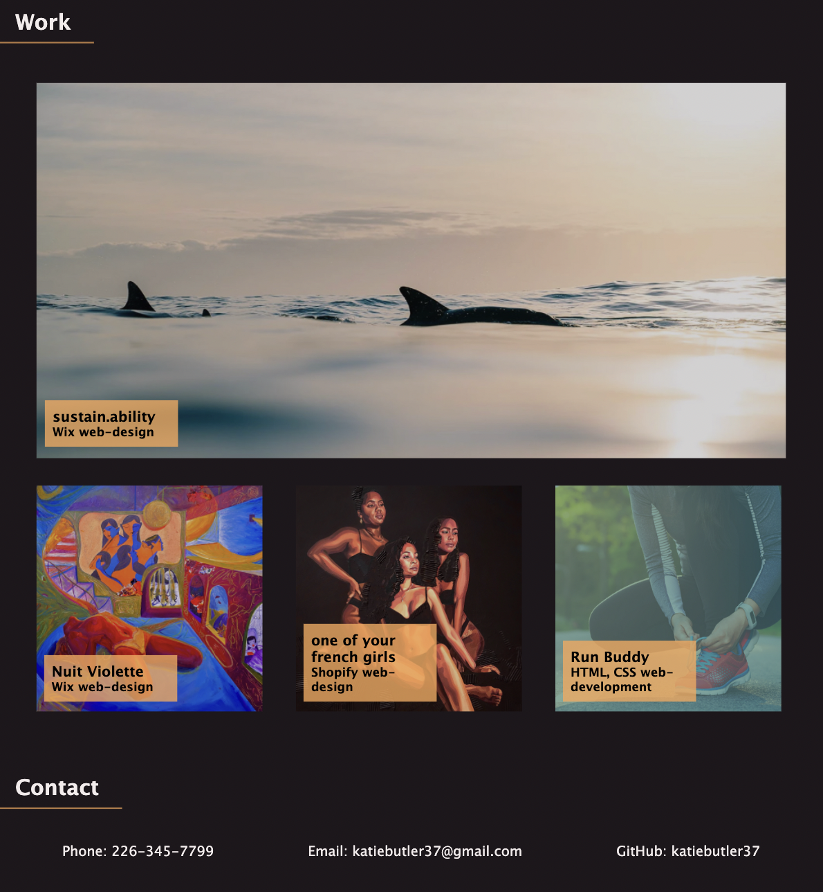

# Professional Portfolio

## Description

- My Portfolio repository was created to display my professional history in web design and development in an organized manor for employers to gain a sense of my capabilities in these areas.
- This project has allowed me to strengthen my proficiency working with HTML structuring and CSS styling, specifically responsive behaviour and media queries, through application and practice, so that I may ensure all future sites I create promote positive user experiences irrespective of screen size.   

### Page Preview

### Link to Application

[View in browser](https://katiebutler37.github.io/portfolio/)
